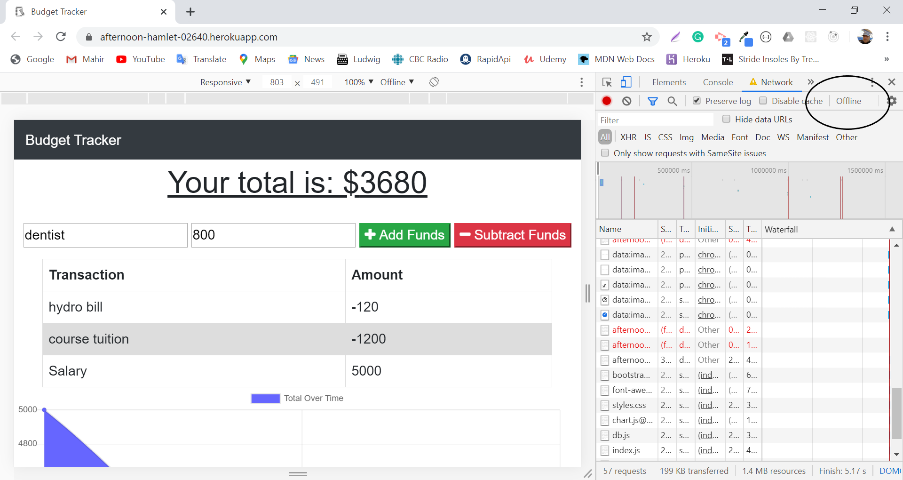
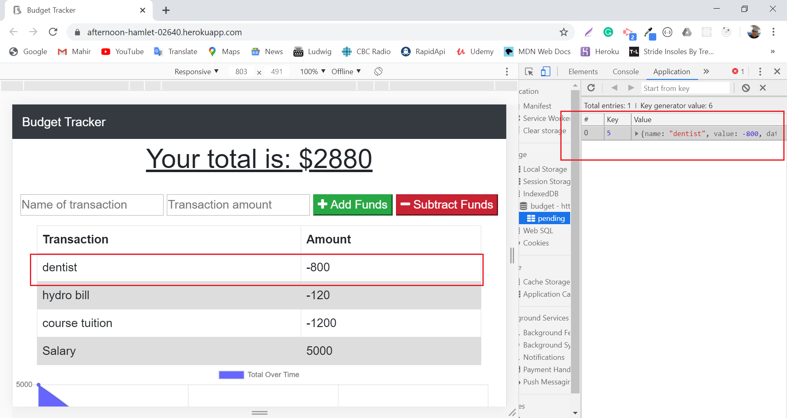
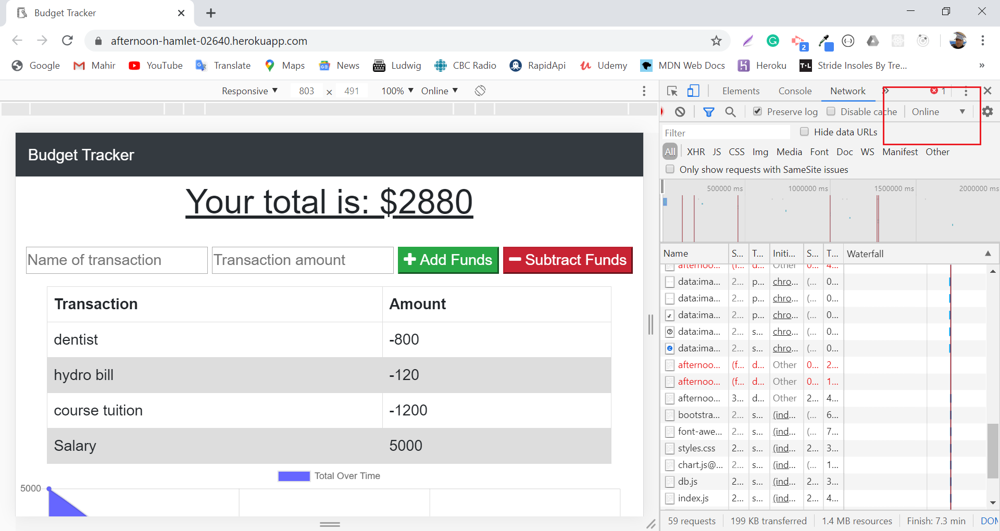
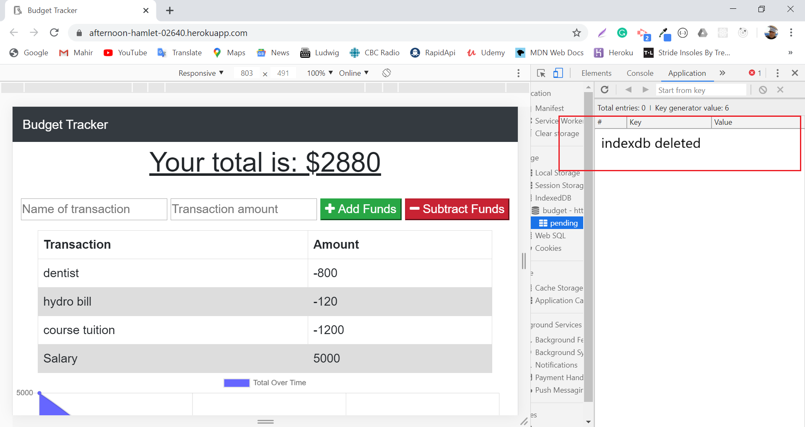
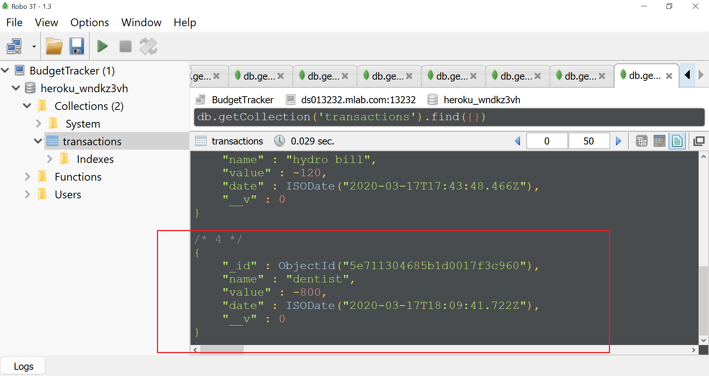

## BudgetTracker

#### Unit 18 PWA Homework: Online/Offline Budget Trackers

This is a Node.js, Express, MongoDB, Mongoose and indexDB application that users can track their budget.

The user be able to track his/her withdrawals and deposits with or without a data/internet connection.

Heroku hosting path is as below:
https://afternoon-hamlet-02640.herokuapp.com

Once internet connection is off

Transaction is saved on indexDB which named pending

When the connection is back online 

Transactions are transfered to the MongoDB

